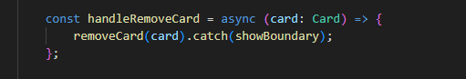
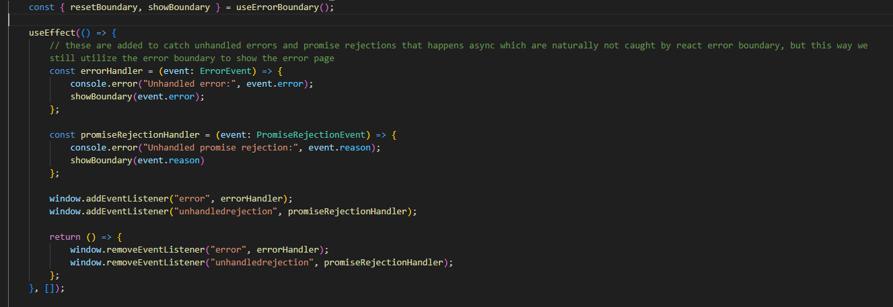
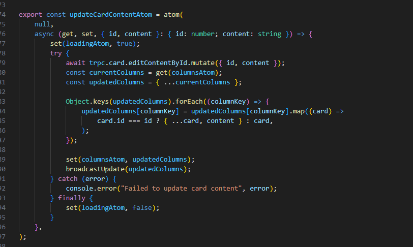
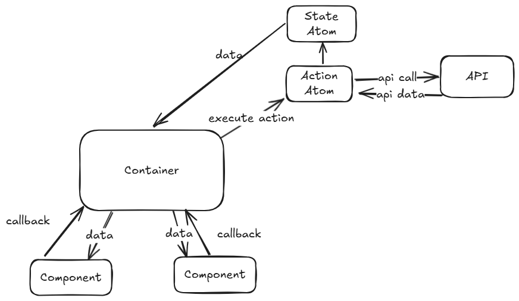
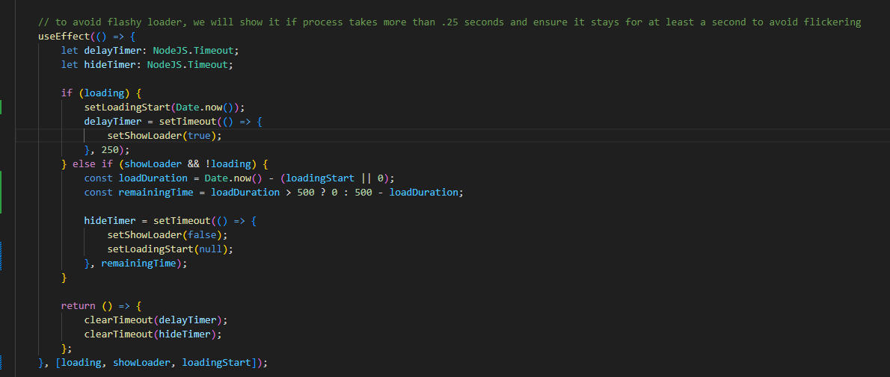
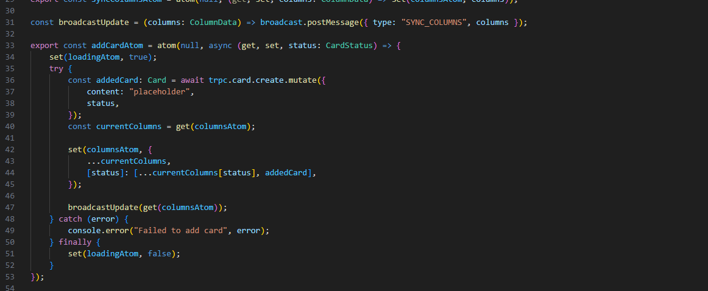

# This will be overall guide of the app implementation

# Postgresql Docker Container Setup Guide

- first time setup
    - docker pull postgres (pull postgres image)
    - docker run --name postgres-container -e POSTGRES_PASSWORD=mysecretpassword -d postgres (start container using postgres image)
    - docker ps (verify container is running)
    
- post first time setup
    - docker ps -a
    - copy postgres container id
    - docker start {container_id}

# Code Standradisation

- we are using eslint along with prettier to enforce rules on all team members, why is that useful? to avoid making PRs hard to review due to lots of format changes
- we have a base tsconfig that is shared by apps, and each can add its own/overwrite some rules based on its needs as nodejs and react apps might have different needs.

# CI/CD

- we are using github actions to check the following
    - linting
    - app building
    - executing tests

# Containerisation

- we are using docker as per the following
    - Docker image for each app
    - Docker compose on root level that spins up those apps along with postgresql container for our prisma to be connected to

# Error Handling

we have two types of errors

sync -> anything related to data processing or component rendering lifecycle
async -> anything relate to api calls/ user event such as button click (covering those errors is important to avoid user confusion -> bad ux -> lose of customers -> loss of money(which we dont want right!))

- We are using 'react-error-boundary'
    why? because it allows us to overcome native error boundary drawbacks which is catching sync errors only, but with this package you can manually trigger the error boundary upon async errors using `showBoundary(error)`. and you have option to reset error state which is quite useful

how are we covering all types of errors?

- sync -> automatically caught by error boundary
- handled async -> async calls wrapped with try and catch can still trigger error boundary by passing showBoundary to the catch block

- unhandled async (user event related) -> user related events such as click is not automatically caught but we are listening to those error events and triggering error boundary as well
- unhandled  async (promise rejection related) -> failed api requests results in rejected promise are not not automatically caught but we are listening to those error events and triggering error boundary as well

# Atoms

- Using Jotai as our state manager to store date
- Using Jotai Action Atoms to encapsulate data manipulation process such as API requests, why are we separating it from component? to make the UI component as isolated as possible to become as testable as possible

# Use of Context

- Context was used to avoid prop drilling method from board to card

# Pattern

- we are using container -> component pattern to centralize logic handling at container and make component as dumb as possible for ease of testing

# Advanced loader

- we noticed that process could be sometimes done very quick, so a loader would be flashing resulting in bad user experience and here is how we solved it
- loader wil only be shown after .25 seconds, so if a request takes less than .25 sec, no loading will be shown
- if loading time was less than .5 seconds, loader will still be shown for .5 seconds to achieve a pleasing UX (The idea is to show loader at least .5 secs if loading time was more than .25seconds)
- if loading time was more than .5 seconds, then loader will be hidden instantly 

# Tab Syncing

- we are using broadcast channel for posting and listening to data changes to achieve tabs data sync

